# **Modeling the Wikipedia IT Graph with GATs**

____

# Introduction

Many machine learning practitioners are comfortable working with images, text, or tabular data, but graph-structured data often feels unfamiliar. Yet a large amount of real-world information — social networks, citation networks, knowledge bases, and Wikipedia itself — naturally forms graphs. Traditional deep learning models struggle in these settings because they cannot use the relational structure of the data. This is where **Graph Neural Networks (GNNs)** become powerful.

This project offers a hands-on introduction to applying state-of-the-art graph ML using **PyTorch Geometric (PyG)**. The goal is to show how GNNs can be used on a realistic problem: understanding and organizing the IT domain of Wikipedia. We will go step-by-step through building a graph dataset, generating labels, training a **Graph Attention Network (GAT)**, and evaluating its performance.

Along the way, we compare graph-based learning with more classical deep learning approaches that treat each article as an independent text sample. This helps highlight why structural information — hyperlinks, neighborhood context, and graph topology — matters. Finally, we demonstrate how **graph-aware embeddings** learned by the model can be reused for a simple semantic recommendation system, allowing us to retrieve related articles based on their position in the knowledge graph.

 <center>
 <figure>
  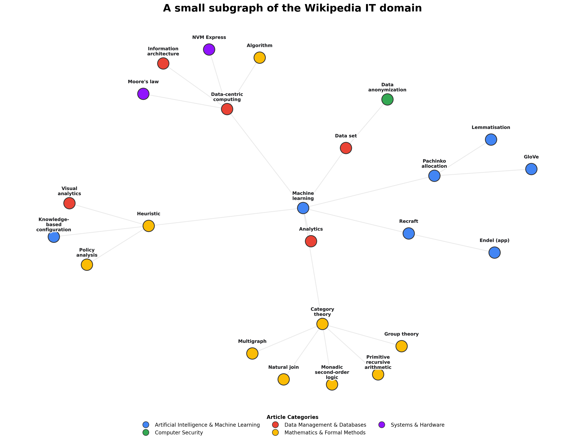
  <figcaption><i>Figure 1: Example of subgraph used in our dataset.</i></figcaption>
</figure>
</center>

___

# Dataset Collection

While academic benchmarks like Cora or PubMed are great for testing models, they don't reflect the messy reality of data engineering. To demonstrate a true **end-to-end ML pipeline** — from data parsing to model deployment — we decided to build our own dataset from scratch.

We focused on the **Information Technology (IT)** domain of Wikipedia. Our objective was to construct a graph where nodes represent articles and edges represent hyperlinks between them.

## 1. Defining the Scope

You can’t simply "download Wikipedia." It is too massive and disconnected. To create a coherent dataset, we needed specific starting points. We manually curated a list of root categories that represent the broad pillars of the IT landscape, ranging from theoretical foundations to applied engineering:

```python
SEED_CATEGORIES = [
    "Category:Information technology",
    "Category:Computer science",
    "Category:Software engineering",
    "Category:Computer security",
    "Category:Artificial intelligence",
    "Category:Data management",
    "Category:Networking",
]
```

From each of these categories, we fetched the full list of member pages and **randomly sampled 30 articles**. These served as our seed nodes — the diverse, distributed centers from which our graph would grow.

## 2. Crawling the Graph

Starting from these seed nodes, we expanded the dataset using a **controlled Breadth-First Search (BFS)**. For every article visited, we extracted links to other Wikipedia pages to form our edges.

However, without strict limits, a crawler starting at "Artificial Intelligence" could easily drift into "Philosophy" and eventually "Ancient Greece" within a few hops. To keep the graph domain-focused, we imposed constraints: `MAX_DEPTH=20` and `MAX_NODES=20,000`.
>You can find the implementation of the crawler in our **[Google Colab Notebook](https://colab.research.google.com/drive/1XCorcXaWqd1anPIBGDZwX5FJ5-tRcokF?usp=sharing)**.


## 3. Filtering the Noise

Despite our careful selection of seeds and crawling limits, the "wild" nature of Wikipedia inevitably introduced noise. Wikipedia is highly interconnected: an article about **Artificial Intelligence** might link to **Alan Turing**, which in turn links to **1954 deaths**, **British mathematicians**, or even **History of the United Kingdom**. While these are valid facts, they dilute the technical focus of our IT dataset.

We found that our initial graph contained thousands of articles related to biographies, geographical locations, films, and historical events. To clean the dataset, we inspected the categories attached to each article and applied a rigorous filter.

We defined a "blocklist" of keywords to identify non-technical articles:

```python
NOISE_KEYWORDS = [
    # Biographical & Historical
    "births", "deaths", "living people", "politicians", "monarchs",
    
    # Media & Entertainment
    "films", "television", "musicians", "novels", "video games",
    
    # Geographical & Institutions
    "cities", "countries", "universities", "museums", "establishments",
    
    # Meta & Linguistics
    "disambiguation", "articles", "redirects", "spoken articles"
]
```

If an article's categories contained any of these terms, the node was removed.

This rigorous filtering came at a cost. While we successfully curated a high-quality core of **7,934 IT-related articles** (removing over 6,600 noisy nodes), we severely fragmented the graph structure. Deleting nodes deletes their connections, causing our total link count to plummet from **44,008 to just 7,859**. This left many articles isolated — a major problem for GNNs that rely on connectivity. We will address this fragmentation in the **Graph Reconstruction** section by reconstructing the graph topology.

## 4. From Chaos to Classes: Automated Labeling

We now had a clean set of text articles, but supervised learning requires distinct target labels. Wikipedia provides **categories**, but they are too granular to serve as labels directly (e.g., _"Software companies established in 1998"_ is not a useful high-level class).

To convert this noisy metadata into a clean classification dataset, we designed a **three-stage automated labeling pipeline**.

### Stage 1: Taxonomy Design

First, we needed to define the ground truth classes. We calculated the frequency of every category in our dataset and fed the most popular ones into **GPT-5**. We asked the model to distill these thousands of specific tags into **7 distinct high-level topics** that cover the IT domain.

The resulting Taxonomy:
1. **Programming & Software**
2. **Computer Security**
3. **Artificial Intelligence & Machine Learning**
4. **Data Management & Databases**
5. **Systems & Hardware**
6. **Networking & Protocols**
7. **Mathematics & Formal Methods**

 <center>
 <figure>
  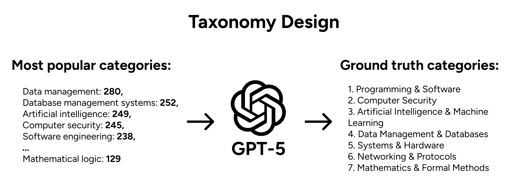
  <figcaption><i>Figure 2: Taxonomy design process.</i></figcaption>
</figure>
</center>

### Stage 2: Semantic Retrieval Classification

To map articles to these classes, we treated classification as a **semantic retrieval task:**
1. We generated a detailed textual description for each of the 7 classes;
2. For every article, we concatenated its _list of categories_ into a single string. We intentionally used categories (metadata) rather than the raw text here to capture how Wikipedia editors organize the content;
3. We embedded both the **Class Descriptions** and the **Article Categories** using the `google/embedding-gemma-300m` model;
4. We calculated the **Cosine Similarity** between each article and the class descriptions, assigning the most probable class.

If the highest similarity score was below a strict threshold, the article was assigned to an **"Other"** class, filtering out ambiguous content.

 <center>
 <figure>
  
  <figcaption><i>Figure 3: Class Retrieval Schema.</i></figcaption>
</figure>
</center>

### Stage 3: LLM-as-a-judge Refinement

While semantic similarity is powerful, it lacks nuance. To ensure our ground truth was high-quality, we applied an **LLM-as-a-judge** step.

We took the predictions from Stage 2 and fed them — along with the article’s **Title** and **Full Text** — into a Large Language Model. The LLM acted as a reviewer, verifying whether the retrieved class truly matched the article's content (e.g., ensuring a "Python" article refers to the programming language, not the animal) and correcting misclassifications.

 <center>
 <figure>
  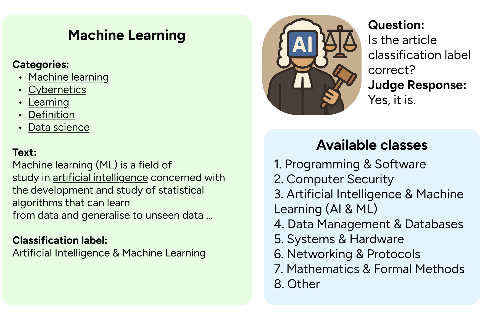
  <figcaption><i>Figure 4: LLM validating the assigned class.</i></figcaption>
</figure>
</center>
<center>
 <figure>
  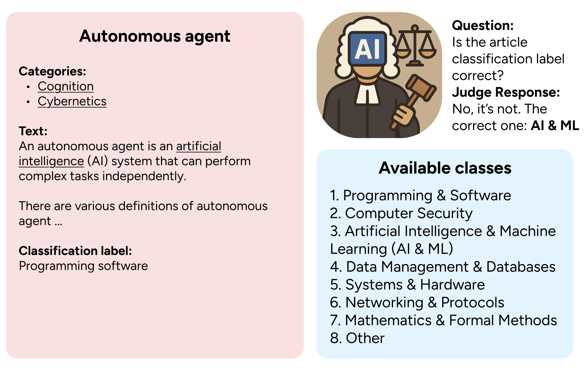
  <figcaption><i>Figure 5: LLM correcting the assigned class.</i></figcaption>
</figure>
</center>

This process yielded a high-quality dataset with **8 distinct classes** (7 topics + "Other"). We now have the nodes, the text, and the labels. The final piece of the puzzle is **Graph Reconstruction**: restoring the connections we lost during cleaning and preparing the features for our GNN.

## 5. Graph Reconstruction

At this point, we had a clean dataset with high-quality labels, but our graph topology was severely damaged. The aggressive filtering in Section 3 removed "bridge" nodes, turning a connected web into thousands of isolated islands. A GNN cannot learn effective message passing on such graphs. To fix this, we introduce the following techniques.

### Connecting 2-hop neighbors via virtual edges

First, we looked at the original links before filtering. Many deleted nodes acted as connectors (e.g., a "List of Programming Languages" page connecting "Python" and "C++"). When we removed the connector, we lost the path.

To preserve this information, we applied a **2-hop connection rule**: if the original graph contained a path A → B → C, and node B was removed as noise, we automatically created a direct edge A → C. This simple heuristic salvaged thousands of valid relationships that would otherwise have been lost.

<center>
 <figure>
  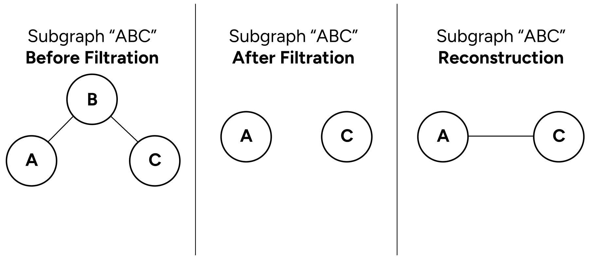
  <figcaption><i>Figure 6: Reconstruction of lost edges using heuristic rule.</i></figcaption>
</figure>
</center>

### Semantic Graph Densification

The 2-hop rule fixed the broken bridges, but the graph remained sparse. Wikipedia hyperlinks are manually created by editors, meaning many semantically related articles might not link to each other simply because no one added the tag.

To fix this, we enriched the graph with **implicit semantic connections**.

1. **Embedding:** We passed the full text of every article through the Gemma model to obtain dense semantic vector representations;
2. **Retrieval:** For every node, we identified its **top-20 nearest neighbors** in the embedding space based on cosine similarity;
3. **Stochastic Connection:** Instead of connecting all 20 neighbors deterministically, we introduced a stochastic element. For each node, we randomly selected between **6 and 20** of these neighbors to form new edges.

After applying these techniques, we successfully restored a dense, interconnected graph structure ready for message passing.

## 6. Feature Engineering

A GNN needs node features to learn from. To generate these, we made a strategic choice to switch to a different embedding model.

### Preventing Data Leakage

Since we already used the **Gemma Embedding Model** to generate our ground truth labels and graph structure, reusing it for input features would introduce **data leakage**. The GNN might simply memorize Gemma's internal patterns instead of actually learning to classify the text. To ensure a robust and fair evaluation, we use **SciBERT** to generate the input features.

### Why SciBERT?

Aside from preventing leakage, SciBERT is excellent for this task. Unlike standard BERT, it is pretrained on a vast corpus of scientific papers. This allows it to better understand technical IT terminology. We freeze the SciBERT model (this means we do not train it) and encode the title and abstract of every article into a **768-dimensional vector**.

## 7. Preparing Data for PyG

To train a GNN, we cannot simply feed raw JSONs or CSVs into the model. We must translate our data into the language of tensors, specifically formatted for **PyTorch Geometric (PyG)**.

> You can find the full preprocessing pipeline in our [Google Colab Notebook](https://colab.research.google.com/drive/1aXbaBVGTfauaGU-8SEtjwcFw3JxKjd1d?usp=sharing).
### Understanding the Data Object

In PyG, a graph is represented by a single `Data` object that holds three essential tensors. Let's break down exactly what dimensions and types PyG expects:

1. **Node Features (`x`):** A matrix of shape `[num_nodes, num_features]`. Each row corresponds to a node, and columns are the features (e.g., text embeddings).
2. **Graph Connectivity (`edge_index`):** This is unique to Graph ML. Instead of an adjacency matrix (N×N, which is memory-heavy), PyG uses the **COO (coordinate) format** — a tensor of shape `[2, num_edges]`.
    - Row 0 contains source node indices.
    - Row 1 contains target node indices.
3. **Labels (`y`):** A tensor of shape `[num_nodes]` containing class indices (integers) for classification.

### Generating Node Features

First, we vectorize the text. We load our SciBERT model and encode the first 750 characters of every article. Truncating the text accelerates processing while retaining the most informative part (the abstract).

```python
import torch
from sentence_transformers import SentenceTransformer

# Load Model
model_id = "jordyvl/scibert_scivocab_uncased_sentence_transformer"
model = SentenceTransformer(model_id)

# Truncate text to 750 chars for efficiency
prompts = [nodes_dict[t].get("text", "")[:750] for t in titles]

# Generate Embeddings
embeddings = model.encode(prompts, show_progress_bar=True, convert_to_numpy=True)
x = torch.tensor(embeddings, dtype=torch.float)

print(f"Feature Matrix: {x.shape}") 
# Output: torch.Size([6093, 768])
```

### Processing Structure & Labels

Next, we map our string data to integer tensors. We convert category names to class IDs (0-7) and map article titles to node indices to build the adjacency list.

```python
import torch
from torch_geometric.utils import to_undirected

# 1. Map Keys to Integers
titles = list(nodes_dict.keys())
title_to_idx = {title: i for i, title in enumerate(titles)}

categories = set(d['category'] for d in nodes_dict.values())
cat_to_idx = {cat: i for i, cat in enumerate(categories)}

# 2. Create Label Tensor (y)
y = torch.tensor([cat_to_idx[nodes_dict[t]['category']] for t in titles], dtype=torch.long)

# 3. Create Edge Index
edge_indices = []
for src, dst in dataset_json['edges']:
    if src in title_to_idx and dst in title_to_idx and src != dst:
        edge_indices.append([title_to_idx[src], title_to_idx[dst]])

# Convert to [2, E] tensor and ensure graph is undirected
edge_index = torch.tensor(edge_indices, dtype=torch.long).t().contiguous()
edge_index = to_undirected(edge_index)
```

### Assembling the Data Object

Now that we have our Features (`x`), Structure (`edge_index`), and Labels (`y`), we package them into the unified **PyTorch Geometric** container.

```python
from torch_geometric.data import Data

# Assemble the Data Object
data = Data(x=x, edge_index=edge_index, y=y)
print(data)
# Data(x=[6093, 768], edge_index=[2, 56470], y=[6093])
```
### Graph Statistics

Now that the graph is ready, let's inspect its properties.

```python
def print_graph_stats(data):
    avg_degree = data.num_edges / data.num_nodes
    print(f"Nodes: {data.num_nodes} | Edges: {data.num_edges}")
    print(f"Average Degree: {avg_degree:.2f}")
    print(f"Isolated Nodes: {data.has_isolated_nodes()}")
    print(f"Self-Loops:     {data.has_self_loops()}")

print_graph_stats(data)
```

```sh
Nodes: 6093 | Edges: 56470
Average Degree: 9.27
Isolated Nodes: False
Self-Loops:     False
```

Finally, we check the class distribution to understand the difficulty of the task:

 <center>
 <figure>
  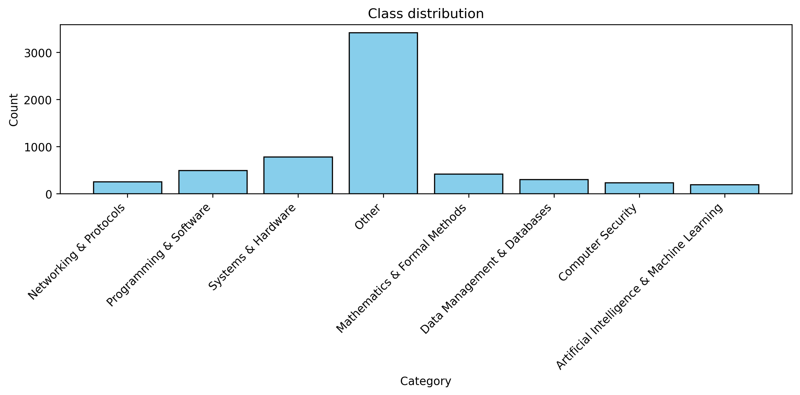
  <figcaption><i>Figure 7: Distribution of target class.</i></figcaption>
</figure>
</center>

The dataset is heavily imbalanced. Approximately 50% of the articles belong to the **"Other"** category. A trivial model predicting "Other" for everything would achieve 50% accuracy.

During evaluation, we must prioritize **Weighted Precision/Recall** and **F1-Score** over raw accuracy to ensure the model actually learns the minority classes (like *AI & ML* or *Networking & Protocols*).

 <center>
 <figure>
  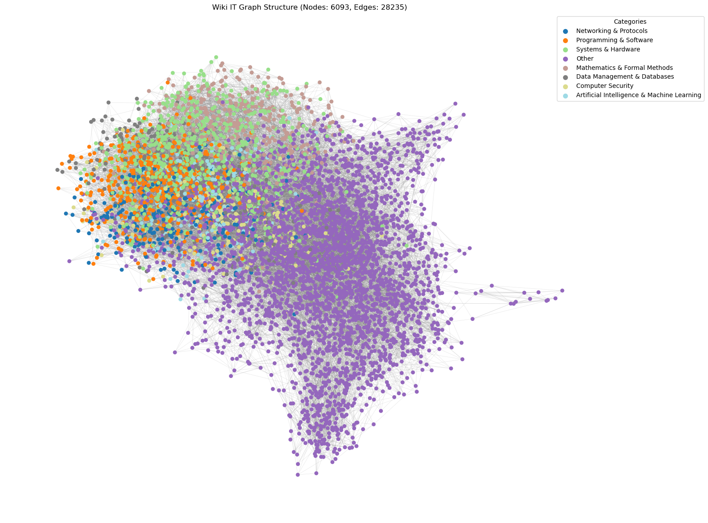
  <figcaption><i>Figure 8: The structure of final Wikipedia IT graph.</i></figcaption>
</figure>
</center>

### Training Strategy: The Splitting Dilemma

Before finalizing the dataset, we had to decide how to split the data. In standard ML, you simply shuffle samples and separate them. In graphs, however, splitting is tricky because samples (nodes) are connected.

There are two main strategies to handle this:

1. **Inductive Split (Failed):** We initially tried physically cutting the graph into separate subgraphs (Train/Val/Test) and removing connecting edges. This **backfired** because it destroyed the topology — test nodes became isolated, leaving the GNN with no neighbors.
2. **Transductive Split (Chosen):** We feed the **entire graph** into the model but use **boolean masks** to hide labels. The model calculates loss _only_ on training nodes, but messages can flow through the whole graph. This preserves connectivity.

<center>
 <figure>
  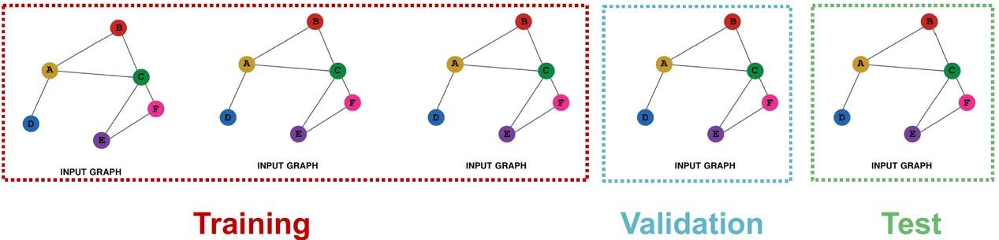
  <figcaption><i>Figure 9: Inductive data split example.</i></figcaption>
</figure>
</center>

<center>
 <figure>
  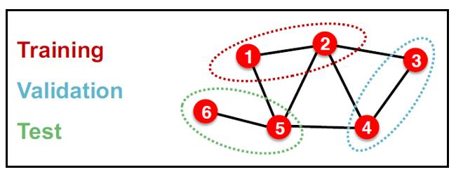
  <figcaption><i>Figure 10: Transductive data split example.</i></figcaption>
</figure>
</center>

We implemented the **Transductive** strategy using the following code to generate masks:
```python
import torch

seed = 42
num_nodes = data.num_nodes

# 1. Deterministic Shuffle
# We use a fixed seed to ensure every run produces the same split
g = torch.Generator()
g.manual_seed(seed)
perm = torch.randperm(num_nodes, generator=g)

# 2. Calculate Split Indices
n_train = int(num_nodes * ratios[0])
n_val = int(num_nodes * ratios[1])

# The remainder goes to test to avoid rounding errors
train_idx = perm[:n_train]
val_idx = perm[n_train : n_train + n_val]
test_idx = perm[n_train + n_val :]

# 3. Create Boolean Masks
# Initialize all as False
data.train_mask = torch.zeros(num_nodes, dtype=torch.bool)
data.val_mask = torch.zeros(num_nodes, dtype=torch.bool)
data.test_mask = torch.zeros(num_nodes, dtype=torch.bool)

# Apply masks
data.train_mask[train_idx] = True
data.val_mask[val_idx] = True
data.test_mask[test_idx] = True
```

___
## Dataset Download

This concludes the data engineering phase of our pipeline. We now have a fully constructed graph with rich features, reconstructed edges, and clean labels.

For convenience, you don't need to run the heavy crawling and processing steps yourself. You can download the final prepared dataset directly from our **Google Drive**: [Google Drive Link](https://drive.google.com/drive/folders/1meiA2D5PodBqxQUNpKZLzJsVJWprVvcR?usp=share_link).

___

# Model Training

With our dataset fully prepared, we move to the core of this project: **training a Graph Neural Network**.

Our primary objective is to implement a state-of-the-art graph model — specifically a **Graph Attention Network (GAT)** — that can effectively leverage the relational structure we painstakingly reconstructed. 

To rigorously validate our GNN's performance, we will also train a simple text-based baseline (MLP). This allows us to quantify exactly how much value the graph structure adds compared to treating articles as isolated documents.

## Graph Neural Networks: The Intuition

Before diving into the GAT training, let's clarify how GNNs actually learn.

Traditional neural networks (like MLP) treat every sample in isolation. If you classify the article _"Linux"_, the model sees only its text. It doesn't know that the article connects to _"Torvalds"_ or _"Kernel"_.

GNNs solve this using a process called **Message Passing**. The core idea is simple: **"Tell me who your friends are, and I'll tell you who you are."**

1. **Initialization:** We start by initializing every node with its raw features. In our case, these are the **SciBERT text embeddings** (X) we generated earlier. At step 0, the node knows only about its own content;
2. **Message Passing:** Every node looks at its neighbors and receives their feature vectors;
3. **Aggregation:** The node aggregates these messages (e.g., by averaging them) to understand its local context;
4. **Update:** The node combines this neighborhood information with its own internal features to update its understanding.

By repeating this process (e.g., 2 layers), a node can gather information from its immediate neighbors and _their_ neighbors (2-hop context). The result is a **Graph-Aware Embedding**: a vector that encodes both the semantic content of the article _and_ its position in the Wikipedia topology.

<center>
 <figure>
  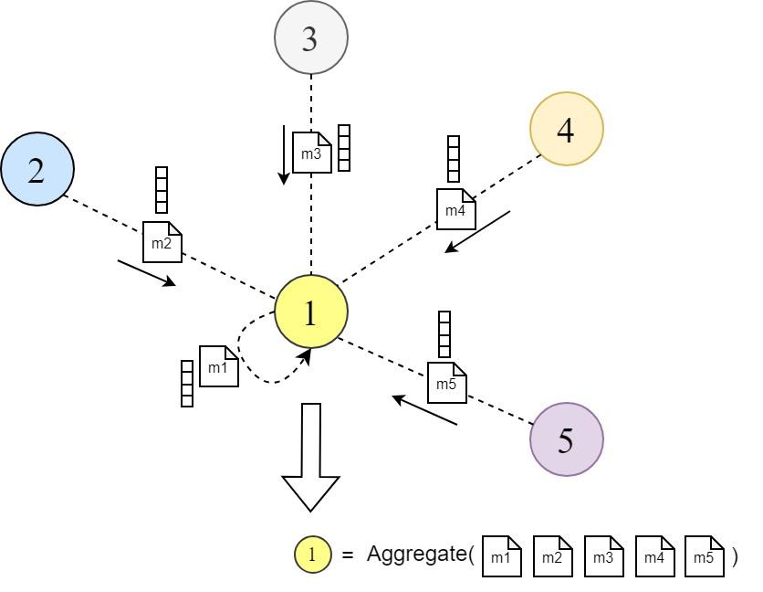
  <figcaption><i>Figure 11: 1-hop message passing overview.</i></figcaption>
</figure>
</center>

<center>
 <figure>
  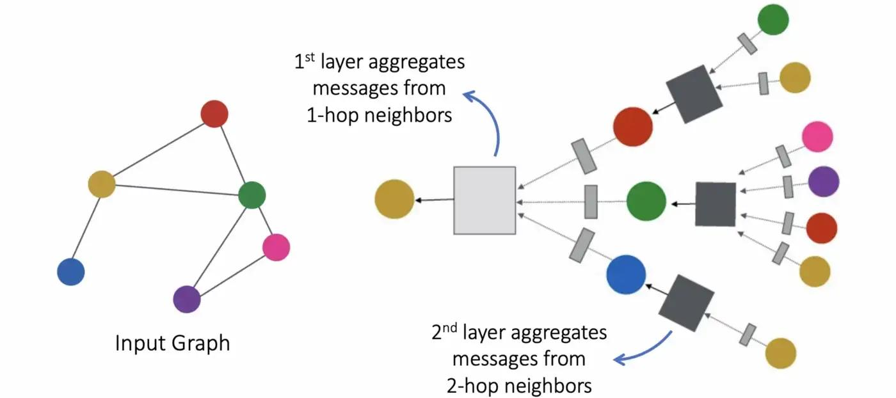
  <figcaption><i>Figure 12: 2-hop message passing overview.</i></figcaption>
</figure>
</center>
## Graph Attention Network

**Graph Attention Networks** represent a major evolution in graph deep learning. While standard models aggregate messages from all neighbors equally, GAT introduces a **learnable attention mechanism**. This enables every node to dynamically decide which neighbors are important and which should be ignored by assigning a specific weight to each connection.

This architecture is particularly powerful for our Wikipedia dataset. Since our graph contains a mix of strong manual links and potentially noisy synthetic edges (from KNN), standard averaging would dilute the signal. GAT, however, can learn to "pay attention" to semantically relevant neighbors (e.g., linking _Python_ to _Programming_) while effectively filtering out irrelevant noise.

### GAT Architecture

To understand GAT, let's focus on how it updates a **single node's embedding**. The mechanism consists of four steps applied to the node and its neighbors.

#### 1. Linear Transformation

First, we project the node features into a hidden space. This is a standard linear layer applied to every node participating in attention mechanism. Even though GNNs are about connectivity, we first need to process the content of each node independently.

<center>
 <figure>
  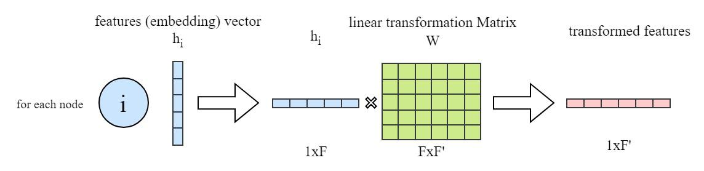
  <figcaption><i>Figure 13: Linear transformation of node features.</i></figcaption>
</figure>
</center>

```python
import torch
import torch.nn as nn
import torch.nn.functional as F

# Setup: 1 Target Node (i) and 3 Neighbors (j1, j2, j3)
h_target = torch.randn(1, 768)      # Node i
h_neighbors = torch.randn(3, 768)   # Nodes j

# 1. Define learnable weight matrix W
W = nn.Parameter(torch.empty(size=(768, 128)))
nn.init.xavier_uniform_(W)

# 2. Project nodes into hidden space
z_target = torch.mm(h_target, W)       # [1, 128]
z_neighbors = torch.mm(h_neighbors, W) # [3, 128]
```

#### 2. Computing Attention Scores

Now comes the core mechanism. We need to compute a raw importance score $e_{ij}$ for every edge connecting node $i$ to node $j$.

The GAT paper defines this score using **concatenation**: it takes the features of the source and target nodes, concatenates them, and passes the result through a learnable weight vector $\vec{a}$.

$$ e_{ij} = \text{LeakyReLU}\left( \vec{a}^T [ \mathbf{W}\vec{h}_i \, \| \, \mathbf{W}\vec{h}_j ] \right) $$

To compute this efficiently in PyTorch without loops, we use a mathematical shortcut. The linear projection of concatenated vectors is equivalent to the sum of their individual projections:

$$ \vec{a}^T [ \mathbf{W}\vec{h}_i \, \| \, \mathbf{W}\vec{h}_j ] = (\vec{a}_{src}^T \mathbf{W}\vec{h}_i) + (\vec{a}_{dst}^T \mathbf{W}\vec{h}_j) $$

This allows us to pre-calculate a "source score" and a "target score" for every node independently and then simply add them together to get the pairwise scores.

<center>
 <figure>
  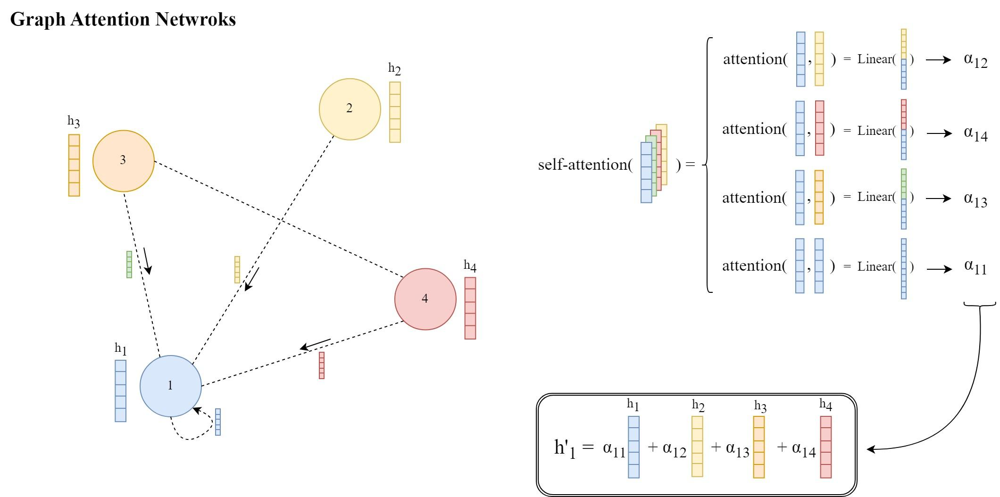
  <figcaption><i>Figure 14: New hidden state calculation.</i></figcaption>
</figure>
</center>

```python
# 1. Define attention vector 'a' split into Source and Target parts
a_src = nn.Parameter(torch.randn(128, 1)) 
a_dst = nn.Parameter(torch.randn(128, 1))

# 2. Calculate "Potentials"
# How much the target 'wants' to receive
score_target = torch.mm(z_target, a_dst)      # [1, 1]

# How much each neighbor 'wants' to send
scores_neighbors = torch.mm(z_neighbors, a_src) # [3, 1]

# 3. Add them to get pairwise scores
# We broadcast the target score to all neighbors
e = scores_neighbors + score_target
e = F.leaky_relu(e, negative_slope=0.2)

print(f"Raw scores e_ij: {e.view(-1)}")
# Output: [0.12, -0.85, 0.44] (One score per neighbor)
```

#### 3. Normalization (Softmax)

The scores $e$ we computed are unnormalized (can be any number like -5 or +10). To turn them into valid weights (probabilities), we apply **Softmax** across the neighborhood.

This ensures that the attention weights sum to 1, meaning the node distributes 100% of its focus among its neighbors.

$$ \alpha_{ij} = \text{Softmax}(e_{ij}) = \frac{\exp(e_{ij})}{\sum_{k \in \mathcal{N}(i)} \exp(e_{ik})} $$

```python
# Normalize scores across the 3 neighbors
alpha = F.softmax(e, dim=0)

print(f"Attention Weights: {alpha.view(-1)}")
# Example Output: [0.35, 0.10, 0.55] 
# (Neighbor 3 is the most important!)
```

#### 4. Weighted Aggregation

This is the final step of the layer. Now that every node knows *how much* to trust each of its neighbors (via $\alpha_{ij}$), it gathers information.

We calculate the **weighted sum** of the neighbors' transformed features.
*   If the attention weight is high (e.g., 0.9), the neighbor's features significantly influence the update.
*   If the attention weight is low (e.g., 0.01), the neighbor is effectively ignored.

$$ \vec{h}'_i = \sigma \left( \sum_{j \in \mathcal{N}(i)} \alpha_{ij} \mathbf{W}\vec{h}_j \right) $$

```python
# Multiply each neighbor by its importance weight
# [3, 128] * [3, 1]
weighted_neighbors = z_neighbors * alpha

# Sum them up to get the new Node Embedding
h_prime = torch.sum(weighted_neighbors, dim=0, keepdim=True)
h_prime = F.elu(h_prime)

print(f"Updated Node Embedding: {h_prime.shape}")
# Output: [1, 128]
```

##### Note: The Importance of Self-Loops

You might notice that in the code above, we only aggregated the 3 neighbors ($j_1, j_2, j_3$). But what about the target node $i$ itself? We don't want it to lose its original information!

To fix this, real GAT implementations add a **Self-Loop**.
1.  We conceptually add the target node to its own list of neighbors.
2.  The neighborhood becomes: $[i, j_1, j_2, j_3]$.
3.  The model calculates an attention score $\alpha_{ii}$ for itself.

This allows the node to dynamically decide: *Should I keep my own features (high $\alpha_{ii}$) or copy my neighbors (low $\alpha_{ii}$)?*

> In PyTorch Geometric you don't need to do this manually. The `GATConv` layer adds these self-loops automatically by default (`add_self_loops=True`).

### 5. Multi-Head Attention

Before finalizing the model, we borrow one last powerful idea from Transformers: **Multi-Head Attention**.

Instead of relying on a single "view" of the graph, we run $K$ independent attention heads in parallel (every head has its own trainable parameters). This gives the model multiple chances to understand the relationships: one head might learn to focus on *semantic similarity*, while another focuses on *structural roles* (for example).

In the hidden layers, we simply **concatenate** the results from all heads to create a rich, high-dimensional feature vector. This expands the model's expressive power.

$$ \vec{h}'_i = \Bigg\|_{k=1}^K \sigma \left( \sum_{j \in \mathcal{N}(i)} \alpha_{ij}^k \mathbf{W}^k \vec{h}_j \right) $$

For the final output layer, however, we change tactics. Rather than creating a massive concatenated vector that requires further projection, GAT typically employs an **averaging strategy**.


$$ \vec{h}'_i = \sigma \left( \frac{1}{K} \sum_{k=1}^K \sum_{j \in \mathcal{N}(i)} \alpha_{ij}^k \mathbf{W}^k \vec{h}_j \right) $$

### 6. The Final Model (PyG Implementation)

We have just built the mathematics of GAT from first principles. However, our manual implementation computed an $N \times N$ attention matrix, which is extremely memory-intensive for large graphs.

Libraries like **PyTorch Geometric** optimize this by using **Sparse Tensors**, computing attention scores *only* for edges that actually exist. This allows us to scale to millions of nodes without running out of RAM.

Below is the actual model we will use for training.

```python
from torch_geometric.nn import GATConv

class GAT(torch.nn.Module):
    def __init__(self, in_channels, hidden_channels, out_channels, heads):
        super().__init__()
        
        # Layer 1: Hidden Layer
        # Input: 768 -> Output: 8 * HiddenDim
        self.conv1 = GATConv(in_channels, hidden_channels, heads=heads, dropout=0.4)
        
        # Layer 2: Output Layer
        # We explicitly Average the heads to get exactly 'out_channels' (8 classes)
        self.conv2 = GATConv(hidden_channels * heads, out_channels, heads=heads, 
                             concat=False, dropout=0.4)

    def forward(self, x, edge_index):
        # 1. First GAT Layer
        x = F.dropout(x, p=0.4, training=self.training)
        x = self.conv1(x, edge_index)
        x = F.elu(x) # ELU activation function
        
        # 2. Second GAT Layer
        x = F.dropout(x, p=0.4, training=self.training)
        x = self.conv2(x, edge_index)
        
        return x
```